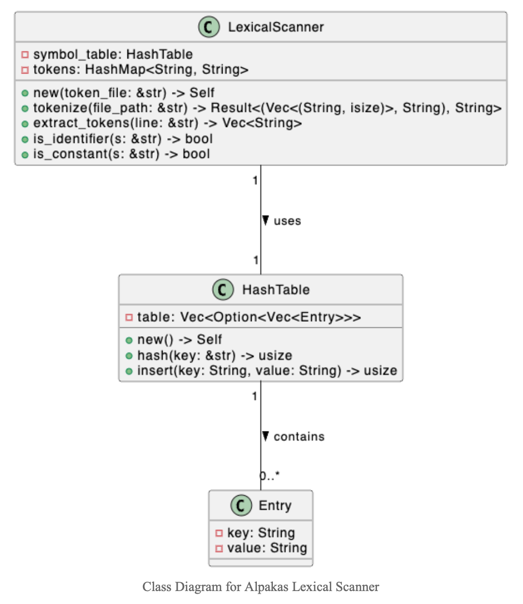

# Alpakas

Mini-language built in Rust for the Formal Languages & Compiler Design university course.

**Student: Iulia-Diana Groza, Gr. 933/1**

### Remarks for Lab Assignments:
**1. [Lab 1b] Code review performed for student Daniel Gulei** <br>
&nbsp;&nbsp;&nbsp;&nbsp;Link: https://github.com/trueNebula/PyPlusPlus/pull/1?fbclid=IwAR2TAynQeLoZyZRlwd6L9yvMVrJ48ed4Zmg-B81SUqtnpY-8sGwBtzJl8t4

## Design


## Implementation
### 1. Symbol Table
The symbol table in Alpakas is a crucial component for managing identifiers and constants within the mini-language. It provides a fast lookup mechanism and ensures the uniqueness of entries. The symbol table uses a single hash table to store both identifiers and constants. 

#### 1.1 Structure - Hash Table
The Alpakas symbol table is implemented as a fixed-size hash table with separate chaining to resolve collisions. It stores key-value pairs where the key is a unique identifier or constant, and the value is its associated information.

##### Fields
* `table: Vec<Option<Vec<Entry>>>`: A vector of options containing vectors of `Entry` objects.

##### Methods
* `new() -> Self`: Initialises an empty hash table of size `TABLE_SIZE`.
* `hash(key: &str) -> usize`: Computes the hash index for a given key.
* `insert(key: String, value: String) -> usize`: Inserts a key-value pair into the hash table and returns its unique position.

#### Usage Example
```rust
let mut symbol_table = HashTable::new();

let position = symbol_table.insert("myVar".to_string(), "Variable Info".to_string());
```

### Lexical Scanner
The lexical scanner is a tool designed to analyse the source code of a program written in Alpakas. It processes the code to identify and categorise various elements such as keywords, operators, identifiers, and constants.

#### Description
The scanner operates by reading the source code file and examining its contents line by line. It uses regular expressions to match patterns in the text, allowing it to recognize different tokens based on the mini-language's syntax. These tokens are then classified into two main categories:
* **Reserved Tokens**: These include keywords, separators, and operators predefined in the mini-language. They are recognized directly by the scanner and are not stored in the Symbol Table. The scanner records these tokens in the Program Internal Form (PIF) with a reference index of -1, indicating that they do not have an associated entry in the Symbol Table.
* **Identifiers and Constants**: When the scanner detects an identifier (a variable name, for example) or a constant (like a number or a string), it adds an entry to the Symbol Table (ST) if it's not already present. Each entry in the ST is given a unique index, which the scanner then uses to record the token in the PIF. This linkage allows the scanner to efficiently reference identifiers and constants without duplicating information.

#### Components
##### Symbol Table (ST)
The Symbol Table is a data structure that maintains a list of all unique identifiers and constants found in the source code. It assigns a unique incremental index to each entry, which is used as a reference in the PIF.

##### Program Internal Form (PIF)
The PIF is a list that tracks all tokens alongside their Symbol Table indices. For reserved tokens, it uses an index of -1, while for identifiers and constants, it uses their respective Symbol Table indices.

#### Structure
The symbol table uses a single hash table to store both identifiers and constants. We also store the list of tokens in the `tokens` field, being represented as a HashMap.

##### Fields
* **symbol_table: HashTable**: Stores identifiers and constants.
* **tokens: HashMap<String, String>**: Predefined tokens of the language.

##### Methods
* **new(token_file: &str) -> Self**: Initialises the scanner with a given token file.
* **tokenize(file_path: &str) -> Result<(Vec<(String, isize)>, String), String>**: Tokenizes the source code and returns the PIF and ST.
* **extract_tokens(line: &str) -> Vec<String>**: Extracts tokens from a given line of code.
* **is_identifier(s: &str) -> bool**: Checks if a string is an identifier.
* **is_constant(s: &str) -> bool**: Checks if a string is a constant.

#### Example of tokenization
```rust
let scanner = LexicalScanner::new("tokens.txt");
let result = scanner.tokenize("program.aks");
if let Ok((pif, symbol_table)) = result {
    // Process PIF and ST...
}
```

#### Regular Expressions Used
The usage of these regex patterns in the lexical scanner helps accurately identify and categorise different elements of the language, aiding in the parsing and tokenization process. These patterns are aligned with common conventions in programming language design, ensuring that the identifiers, constants, and operators conform to expected standards.

##### Identifiers
* **Pattern**: `r"^[a-zA-Z_][a-zA-Z0-9_]*$"`
* **Description**:
  * This regex is used to identify valid identifiers in the Alpakas language.
It matches strings that start with a letter (either uppercase or lowercase) or an underscore, followed by zero or more letters, digits, or underscores.
  * **Breakdown**:
    * `^[a-zA-Z_]`: Asserts that the string starts with a letter (a-z, A-Z) or an underscore (_).
    * `[a-zA-Z0-9_]*`: Followed by any combination of letters, digits (0-9), and underscores, repeated zero or more times.
  * **Example**: Valid identifiers include myVariable, var123, _temp.

##### Integer Constants
* **Pattern**: `r"^\d+$"`
* **Description**:
  * This regex pattern is used to match integer constants.
  * It matches a sequence of one or more digits.
  * **Breakdown**:
    * `^\d+`: Asserts that the string starts and consists entirely of one or more digits (0-9).
  * **Example**: 123, 0, 987654.
  
##### String Constants
* **Pattern**: `r"^\"[^\"]*\"$"`
* **Description**:
  * This regex is designed to match string constants enclosed in double quotes.
  * It matches any sequence of characters, except double quotes, inside double quotes.
  * **Breakdown**:
    * `^\"`: Starts with a double quote.
    * `[^\"]*`: Matches any character except another double quote, repeated zero or more times.
    * `\"$`: Ends with a double quote.
  * **Example**: "Hello, world", "Alpakas123!".

##### Operators
* **Operators**: Such as +, -, *, /.
* **Description**:
  * Operators in Alpakas are not identified using a regex but are instead matched directly with their character representations.
  * This includes arithmetic operators like addition (+), subtraction (-), multiplication (*), and division (/).
  * These operators are typically used in mathematical expressions within the language.


#### Error Handling
If the scanner encounters an unrecognised token, it reports a lexical error, indicating the line number and the invalid token, aiding in debugging the source code.

#### Output Files
After processing, the scanner generates two output files:
* **PIF.out**: Contains the Program Internal Form, listing all tokens and their ST indices.
* **ST.out**: Details the Symbol Table with all unique identifiers and constants indexed.


