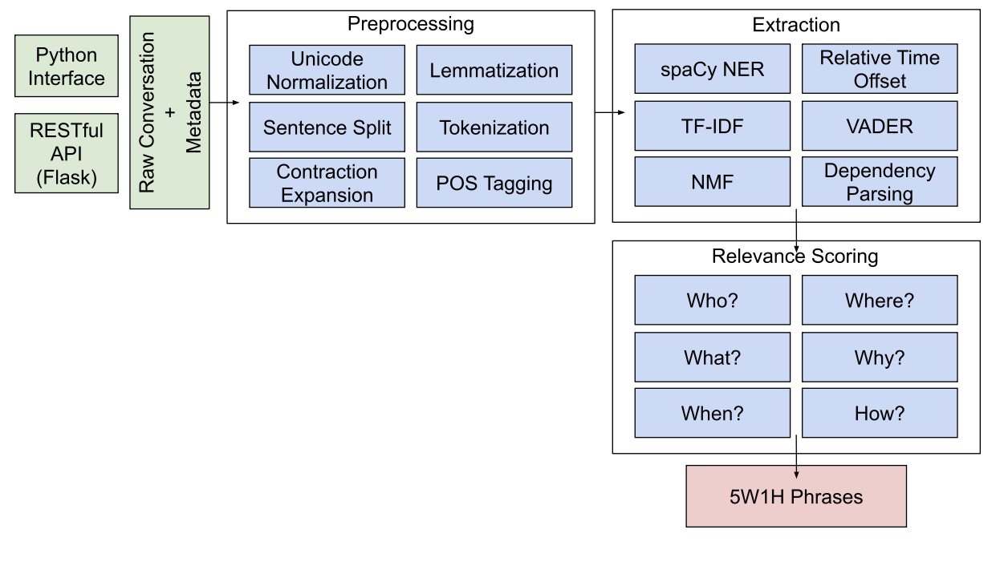

# Mindful - Therapy at Your Fingertips

**Mindful** is a web-based mental health interactive chatbot that performs a comprehensive **5W1H (What, Who, When, Where, Why, How)
extraction** on 1:1 conversations with its users.

Through a clean and simple design, Mindful provides a space for therapy dialogues tailored to individual needs. With a unique approach, it encourages users to explore their emotions in the moment, free from the burden of conversation history.

Mindful elevates user interactions through a sophisticated 5W1H analysis, unraveling the Who?, What?, When?, Where?, Why?, and How? of each conversation. This deep dive provides profound insights into the user's emotional landscape, fostering a personalized and empathetic experience. 

To achieve this, we employed advanced natural language processing techniques, including custom **Named Entity Recognition (NER)**, **Sentiment Analysis**, **Topic Modeling (TF-IDF) & Association**, **Non-negative Matrix Factorization** and **Dependency Parsing**. These intelligent methods were crucial for accurately dissecting complex, nuanced conversations and extracting relevant information.

